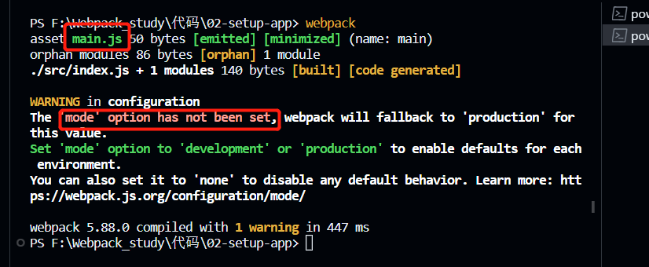
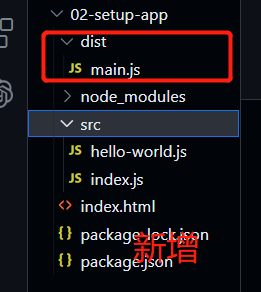
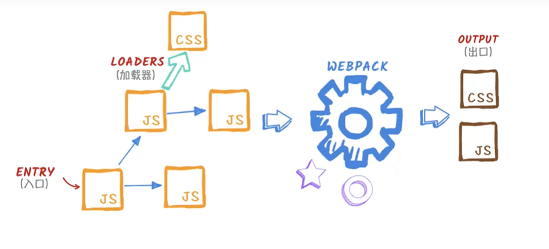
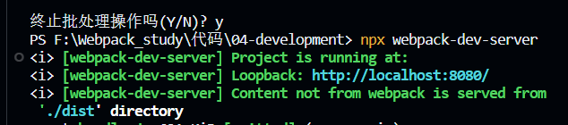
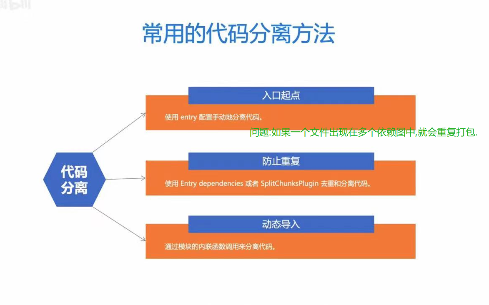

# Webpack基础应用

## 为什么需要Webpack

### 解决作用域问题

- 使用**立即执行函数**解决作用域问题.

  ```js
  // 解决作用域问题,编写立即执行函数
  ; (function () {
      let myName = 'ppgo8'
  })()
  // 立即执行函数的变量不会暴露在外面,因此不会污染作用域
  console.log(myName);
  ```

  

- 改造上面的代码,**同时处理作用域,暴露需要的数据内容**

  ```js
  // 同时解决 1.作用域问题 2.暴露需要内容
  const myName = (function () {
      let myName = 'ppgo8'
      return myName
  })()
  console.log(myName);
  ```

### 解决代码拆分问题

- **方法**

  - `commonjs`是`node.js`项目拆分的绝佳方案

  - 具体而言

    `commonjs`提供了`export`和`require`机制,它允许程序员在当前文件中加载和使用某个模块.

- **使用场景**:只支持在`node.js`上运行,浏览器不支持.

### 如何让浏览器支持模块

- 早期

  使用`Browserify `和 `RequireJS` 等打包工具编写能够在浏览器中运行的 `CommonJS `模块

- 现在

  `ESmodule`但是浏览器的支持不完整

  `Webpack`工具支持`ESmodule`和`Commonjs`,以及其他静态资源支持

  还有个`vite`

## 开发准备

问题：`index.html`文件中如果引入很多个外部`js`文件,而且这些是有顺序关系的,那不是很麻烦吗?


---

### 安装Webpack

全局安装`wbepack`和`wbepack-cli`

```shell
# 全局安装
npm install webpack webpack-cli --global
# 安装成功查看版本
webpack -v
# 全局写在
npm uninstall webpack webpack-cli --global
```

**工作的时候还是建议本地安装,**

1. 初始化

   ```shell
   npm init -y
   ```

   之后在项目的根目录下就有`package.json`文件.

2. 本地工作目录安装`webpack`

   ```shell
   npm install webpack webpack-cli --save-dev
   ```

   之后在本地工作目录下就有`node_modules`和`package-lock.json`文件

本地安装方便进行版本管理


---

### 运行webpack

在集成终端输入`webpack`





`main.js`文件是打包模块得到的


```shell
# 查看打包信息
webpack --stats detailed # 这个webpack是全局的
```

```shell
# 使用本地工作目录的webpack,需要在前面添加npx
npx webpack
```

---

### 自定义Webpack配置

可以使用命令行配置,或者`webpack.config.js`配置文件中配置

- 命令行配置 不常用

  ```shell
  # 设置入口文件
  npx webpack --entry 地址 --mode production
  ```

- `webpack.config.js`配置文件中配置

  ```js
  const path = require('path')
  // node.js中运行需要符合node.js的commonjs语法
  module.exports = {
      // 入口
      entry: './src/index.js', // 将入口文件和其有关js文件打包
      // 出口
      output: {
          filename: 'bundle.js',
          // 此处需要使用绝对路径
          // 使用path模块构建当前路径下的绝对路径
          // 而不是自己直接写死
          path: path.resolve(__dirname, './dist')
      },
      mode: 'none'
  }
  ```

  **结果**:在终端中运行`webpack`,即执行`npx webpack`会在`dist`目录下得到`bundle.js`文件;

  **后续操作**:然后在`index.html`中手动引入打包好的`js`,

>**疑问**
>
>是不是每次都要手动重新引入打包好的文件? 下一节解答

## 自动引入资源

### webpack打包原理

webpack会将**入口文件及其依赖**经过一系列操作得到**输出结果**,即打包文件.



中间的操作需要使用一系列**插件辅助工作**

### 使用HtmlWebpackPlugin


使用`html-webpack-plugin `插件解决需要手动在`html`文件中引入`js`模块的问题.

```shell
# 本地目录,开发环境安装html-webpack-plugin
npm i html-webpack-plugin -D
```

此时再执行`npx webpack`,在输出目录下还会有一个`index.html`,在`<head>`标签中帮我们引入了生成的`js`


在`webpack`的配置文件中作如下配置即可:

```js
const path = require('path')
const HtmlWebpackPlungin = require('html-webpack-plugin')

module.exports = {
    entry: './src/index.js',
    output: {
        filename: 'bundle.js',
        path: path.resolve(__dirname, './dist')
    },
    mode: 'none',

    // 重点: 配置插件
    plugins:[
        // 插件若想使用必须先实例化
        new HtmlWebpackPlungin({
            // 参考模板的文件
            template:'./index.html',
            // 输出文件的名字
            filename:'app.html',
            // 在html中的body标签中生成新的js引入标签
            inject:'body'

        }),
    ]
}
```


>**疑问**
>
>打包后会生成新的html文件,那么此时能否清除之前旧的`html`文件?下一节解答

### 清理dist

输出新的打包文件时清除旧的文件

```js
 output: {
        filename: 'bundle.js',
        path: path.resolve(__dirname, './dist'),
        
        // 重点:输出的同时清除旧的html
        clean: true
    },
```


>**疑问**
>
>现在很多工作都是手工的,比如复制页面到浏览器中查看效果;还需要手动刷新浏览器;下一节解答

## 搭建开发环境

本节搭建开发环境解决上述的问题,**减少大部分手工操作**,让开发更丝滑.

### mode选型

下面的配置

```js
// 模式:开发模式、生产模式或者none
mode: 'development',
```

但是打包后的东西程序员读不懂,解决办法见下一节

### 使用source map

使用下面的**配置**可以帮助调试 ,精准定位错误代码行数

```js
 devtool:'inline-source-map',
```

### 使用watch mode(观察模式)

下面的**命令行**打包会自动编译,不用多次运行`npx webpack`

```shell
npx webpack --watch
```

<font color=red>但是还需要手动刷新</font>

### 使用webpack-dev-server

第一步:安装包

```shell
# npm安装
npm install webpack-dev-server -D
```

第二步:在**配置**文件中配置

```js
 devServer: {
        static: './dist'
}
```

第三步:命令行执行命令
```shell
npx webpack-dev-server
```



执行后进入8080网址,**更改内容**网页<font color=red>自动刷新</font>

他使用的是-**热模块更新**和**实时更新**.

## 资源模块介绍

webpack只能处理javascript的模块，如果要处理其他类型的文件，可以使用资源模块或`loader`。

之前的项目只打包了`js`,那么可以打包**任意其他类型的文件吗?**

`webpack`提供的**资源模块**`asset module`允许`webpack`打包其他类型的资源

资源模块类型，通过添加 4 种新的模块类型，来替换所有这些loader：asset/resource 发送一个单独的文件并导出 URL。

- asset/inline 导出一个资源的 data URI。
- asset/source 导出资源的源代码。
- asset 在导出一个 data URI 和发送一个单独的文件之间自动选择。


## 管理资源

### 什么是loader

除了资源模块外,webpack还可以使用loader去解析其他文件。

- **作用**:`loader `用于对模块的源代码进行转换。

  - 让 webpack 处理那些非 JavaScript 文件(webpack 自身只理解 JavaScript)。

  - 将所有类型的文件转换为 webpack 能够处理的有效模块,然后使用 webpack 打包。

- **作用**:`loader `可以在 `import` 或 "`load(加载)`" 模块时预处理文件。

### 加载css

- 使用loader加载css文件

1. 下载包

   ```sh
   # 加载css文件
   npm i install css-loader -D
   # 把css文件放在页面上
   npm install style-loader -D
   ```

2. 配置文件

   ```js
   {
       test: /\.css/,
       // webpack加载包的顺序从后向前;先用css所以得写在后面
       use: ['style-loader', 'css-loader'], 
   }
   ```

- loader也可以解析saas和less

  1. 下载包

     ```sh
     npm i less-loader -D
     ```

  2. 配置文件

     ```js
     {
         test: /\.(css|less)/,
         use: ['style-loader', 'css-loader', 'less-loader'],
     }

### 抽离和压缩CSS

#### 抽离css

`style-loader`将css加载到页面的`style`标签中,**能不能将这些样式放在一个单独的文件里加载到页面中?**

1. 安装插件

   ```sh
   npm i mini-css-extract-plugin -D
   ```

2. 在配置文件中引入插件

   ```js
   const MiniCssExtractPlugin = require('mini-css-extract-plugin')
   ```

3. 修改配置项

   ```js
   // 第1处
   // 使用默认配置
     plugins: [ new MiniCssExtractPlugin() ],
       
   // 或使用自定义配置,修改输出结果
     plugins: [
       new MiniCssExtractPlugin({
         // 在styles文件下生成文件
         filename: 'styles/[contenthash].css'
       })
     ],
         
   // 第2处      
   {
       test: /\.(css|less)/,
       // 之前的第一个style的laoder要删除
       use: [MiniCssExtractPlugin.loader, 'css-loader', 'less-loader'],
   }
   ```

4. 编译结果

   dist文件夹下多了一个`main.css`文件,且`html`中多了一个`link`标签载入了`main.css`.

#### 压缩css文件

1. 下载包

   ```shell
   npm i css-minimizer-webpack-plugin -D
   ```

2. 导入插件

   ```js
   const CssMinimizerWebpackPlugin = require('css-minimizer-webpack-plugin')
   ```

3. 修改配置

   ```js
   mode: 'production',
       
   optimization: {
       minimizer: [
         // 还需要mode改为production
         new CssMinimizerWebpackPlugin()
       ]
     }
   ```

4. 编译后会发现生成的`css`文件被压缩了.

### 加载images图像

将图片引入到css文件中,会自动加载带有图片的css到页面中

没看到特别的操作

只需要操作css引入图片

### 加载fonts字体


### 加载数据


### 自定义JSON模块和parse


## babel-loader

- **为什么需要babel-loader?JS文件需要转换吗?**

  - webpack 自身可加载JS文件、JSON文件，无需任何 loader。

    加载的JS文件会原样输出，即使JS文件里包含ES6+的代码，也不会做任何的转化。

  - **问题**：如果浏览器不支持ES6，那么就无法运行。

  - **方法**：Babel 是一个 JavaScript 编译器，可以将ES6+转化成ES5，使用`babel-loader` 。

1. 安装包

   ```sh
   npm i -D babel-loader @babel-loader @babel/preset-env
   ```

   - `babel-loader `: 在webpack里应用 babel 解析ES6的桥梁

   - `@babel/core `: babel核心模块

   - `@babel/preset-env` : babel预设，一组 babel 插件的集合;会把一组插件整的到一个文件中

2. 修改配置

   ```js
   module:{
       rules:[
           {
               test:/\.js$/,
               use:{
                   loader:'bable-loader',
                   // 排除node_modules中的js文件
                   exclude:/node_modules/,
                   options:{
                       presets:['babel/preset-ent']
                   }
               }
           }
       ]
   }
   ```

3. 打包成功,但是浏览器控制台报错;**因为缺少内容,安装插件**

   ```sh
   # 这个包包含了regeneratorRuntime,运行时需要
   npm i @babel/runtime
   
   # 这个插件会在需要regeneratorRuntime的地方自动require导包,编译时需要
   npm i --save-dev @label/plugin-transform-runtime
   ```

4. 配置插件

   ```js
   module:{
       rules:[
           {
               test:/\.js$/,
               use:{
                   loader:'bable-loader',
                   exclude:/node_modules/,
                   options:{
                       presets:['babel/preset-ent'],
                       // 重点:配置第三步下载的插件
                       plugins:[
                           ['@label/plugin-transform-runtime']
                       ]
                       
                       
                   }
               }
           }
       ]
   }
   ```

## 代码分离

- **定义:**代码分离是可以把代码分离到不同的`bundle`中,

- **作用**

  - 获得更小的`bundle`
  - 控制资源加载的优先级

  使用的好可以极大影响加载时间

- **常用分离方法**

  

### 入口起点

1. 修改配置

   ```js
   entry:{
   	index: './src/index.js',
       another: './src/another-module.js',
   }
   
   // 多入口要分别设置出口
   output:{
       filename:'[name].bundle.js' // [name]可以获得不同入口的key,即index和another    
   }
   ```

2. 打包

   - dist目录下得到两个JS文件`index.bundle.js`,`another.bundle.js`.

   - 使用`HtmlWebpackPlugin`插件得到的`app.html`也将这两个`js`文件引入

> 问题
>
> 如果一个js文件在上述两个入口都出现,会被重复打包

### 防止重复

这个方法会将重复的共享文件单独抽出来打包

#### 方法1:修改入口配置

1. **修改入口的配置**

   ```js
   entry:{
       // 第一个入口文件和它的配置
       index:{
           import:'./src/index.js',
           dependOn: 'shared',
       },
           
       // 第二个入口文件和它的配置
       another:{
           import:'./src/another.js',
           deoendOn:'shared',
        },
       shared: 'lodash'         
   }
   ```

2. **编译结果**

   打包得到三个文件

   - 每个入口文件分别打包得到1个

   - 二者共享的文件`lodash`打包成一个单独的文件`shared.bundle.js`中

#### 方法2:插件

webpack内置的插件`SplitChunksPlugin`

配置`optimization`属性

```js
optimization:{
   // 公共代码处理到单独文件中
   splitChunks: {
       chunks: 'all',
    },
}
```

### 动态导入

在导入的Js代码里设置import


### 懒加载

动态导入的应用1

懒加载也称按需加载,是一种很好的优化网页或应用的方式.


我们在的的基础上，使用懒加载技术/

### 与获取/预加载模块

动态导入的第二个应用


预获取prefetch:在网页资源加载完毕,**网络资源空闲的时候,会去加载将来可能使用的文件**

预加载preload:和懒加载类似,发生行为才会加载


## 缓存

将 `/dist` 目录中的内容部署到 server 上，client（通常是浏览器）就能够访问此 server 的网站及其资源。

**为什么使用缓存:**而最后一步获取资源是比较耗费时间的，这就是为什么浏览器使用一种名为 [缓存](https://en.wikipedia.org/wiki/Cache_(computing)) 的技术。可以通过命中缓存，以降低网络流量，使网站加载速度更快.

**问题:**然而，如果我们在部署新版本时不更改资源的文件名，浏览器可能会认为它没有被更新，就会使用它的缓存版本。由于缓存的存在，当你需要获取新的代码时，就会显得很棘

**设置**:此指南的重点在于通过必要的配置，以确保 webpack 编译生成的文件能够被客户端缓存，而在文件内容变化后，能够请求到新的文件。

## 拆分开发环境和生产开发环境配置

现在只能手工切换mode,来换环境

开发环境和生产环境有很多配置的不同,比如开发环境没必要设置缓存,生产环境还需要设置公共目录

拆分配置可以让打包更灵活

### 公共路径

公共路径使用`publicPath`来配置的,可以通过它指定**应用程序所有资源的基础路径**.

在output里面配置

### 环境变量

消除开发环境和生产环境之前的差异

### 拆分配置文件

单独建议一个config文件夹,里面保存

`webpack.config.dev.js`

`webpack.config.pro.js`

一个配置文件做开发文件配置

```sh
# 编译的时候代码
npx webpack './config/webpack.config.dev.js'
```

这种打包方式需要将output的目录修改为../


一个配置文件做生产文件配置

### npm脚本

每次打包或启动服务时，都需要在命令行里输入一长串的命令。

配置 npm 脚本来简化命令行的输入，这时可以省略 npx ：


在packjson中

```js
{
    "scripts": {
        "start": "webpack serve -c ./config/webpack.config.dev.js",
        "build": "webpack -c ./config/webpack.config.prod.js"
    }
}
```

开发环境运行脚本

```sh
# 执行开发环境
npm run start
# 执行生产环境
npm run build
```

### 提取公共配置

单独建议一个config文件夹,里面保存

`webpack.config.common.js`

`webpack.config.dev.js`

`webpack.config.pro.js`

### 合并配置

如何合并差分好的文件?

使用webpack-merge包

