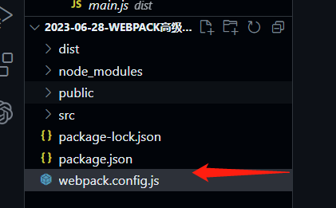

# Webpack基础应用

## 搭建项目结构

第一步,搭建结构

webpack_code # 项目根目录（所有指令必须在这个目录运行）
    └── src # 项目源码目录

​        ├── js # js文件目录
​        │   ├── count.js
​        │   └── sum.js
​        └── main.js # 项目主文件

​    └── public # 长久不变的静态资源


src静态资源目录

main.js / index.js 项目入口文件,在src下

public长久不变的静态资源,如index.html **注意这个文件和src同一级**


第二步,初始化包、下载依赖

```sh
npm init 
npm install webpack webpack-cli --save-dev
```


第三步.编译

npm用来下载包

npx会将node_modules的bin目录当做环境变量,这样就可以访问这个文件下的内容

```sh
 # 没写配置文件的写法
 npx webpack ./src/main.js --mode=development
 
 # 写了配置文件只需要
  npx webpack
```

成功后得到dist目录下的输出,但是注意webpack只能打包`es6 `模块化语法,其他语法不能打包

## 基本配置



webpack.config.js文件写在最外层,注意不要写错位置

```js
const path = require('path')

module.exports = {
    // 入口
    entry: './src/main.js',    // 相对路径
   
    // 输出
    output: {
        // 文件输出路径
        // __dirname代表这行代码所在文件的文件夹目录
        path: path.resolve(__dirname, 'dist'),    // 绝对路径
        // 文件名
        filename: 'main.js',
    },
    
    // 加载器
    module: {
        rules: [
            // loader的胚子
        ]
    },   

    // 插件
    plugins: [
        // 插件的配置
    ],   
    // 模式
    mode: 'development',
}
```

## 开发模式

开发模式主要做两件事:

1. **编译代码**,使浏览器能够识别运行

   webpack不能识别样式、字体图标、图片、html资源等,所以需要**加载配置**编译这些资源

2. 代码质量检查,树立代码规范

    ==key==   

## 处理样式资源

## 处理图片资源

## 修改输出资源的名称和路径

之前编译后的输出很乱,现在想让他们一起整齐点,放在对应的文件夹下.


## 自动清空上次打包资源

```js
output: {
    path: path.resolve(__dirname, "dist"),
    filename: "static/js/main.js",
        
    clean: true, // 自动将上次打包目录资源清空 
  },
```

## 处理Html资源

之前都是在`index.html`中手动引入打包后的文件,希望可以自动引入打包后的资源.

使用插件自动引入

1. 下载包

   ```sh
   npm i html-webpack-plugin -D
   ```

2. 配置

   ==webpack.config.js==

   ```js
   const HtmlWebpackPlugin = require("html-webpack-plugin");
   
   plugins: [
       new HtmlWebpackPlugin({
         // 以 public/index.html 为模板创建文件
         // 新的html文件有两个特点：1. 内容和源文件一致 2. 自动引入打包生成的js等资源
         template: path.resolve(__dirname, "public/index.html"),
       }),
     ],

## 开发服务器&自动化

每次写完代码都需要手动输入指令才能编译代码，太麻烦了，自动化

1. 下载包

   ```sh
   npm i webpack-dev-server -D
   ```

2. 配置

   ```js
    // 开发服务器
     devServer: {
       host: "localhost", // 启动服务器域名
       port: "3000", // 启动服务器端口号
       open: true, // 是否自动打开浏览器
     },
   ```

3. 编译

   ```sh
   npx webpack serve # 不输出任何内容
   ```


当使用开发服务器时，**所有代码都会在内存中编译打包，并不会输出到 dist 目录下。**

开发时只关心代码能运行，有效果即可，至于代码被编译成什么样子，我们并不需要知道。

## 生产模式配置

开发完代码后,代码需要部署上线.

这个模式主要对代码进行优化,==让其运行性能更好==

需要准备两个配置文件

├── webpack-test (项目根目录)
    ├── config (Webpack配置文件目录)
    │    ├── webpack.dev.js(开发模式配置文件)
    │    └── webpack.prod.js(生产模式配置文件)
    ├── node_modules (下载包存放目录)
    ├── src (项目源码目录，除了html其他都在src里面)
    │    └── 略
    ├── public (项目html文件)
    │    └── index.html
    ├── .eslintrc.js(Eslint配置文件)
    ├── babel.config.js(Babel配置文件)
    └── package.json (包的依赖管理配置文件)

```sh
npx webpack --config ./config/webpack.prod.js
```

额外的配置,因为上述代码太长了

```js
// package.json
{
  // 其他省略
  "scripts": {
    "start": "npm run dev",
    "dev": "npx webpack serve --config ./config/webpack.dev.js",
    "build": "npx webpack --config ./config/webpack.prod.js"
  }
}
```

以后启动指令：

- 开发模式：`npm start` 或 `npm run dev`
- 生产模式：`npm run build`

